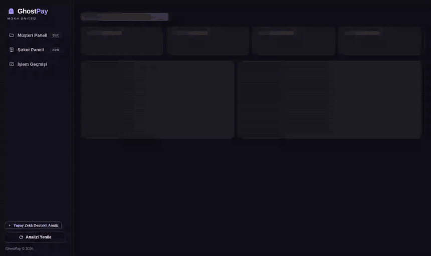
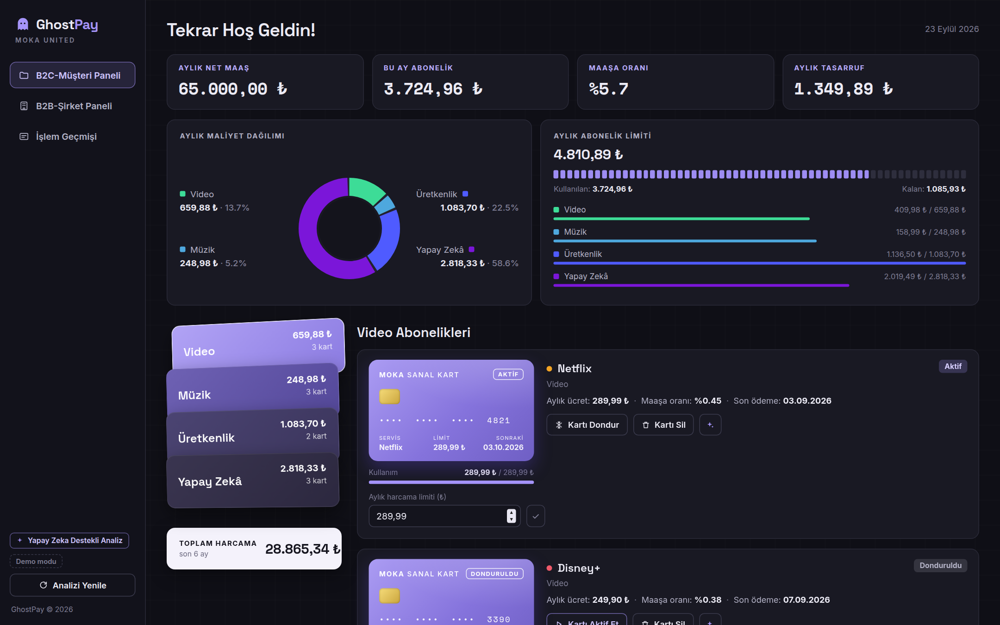
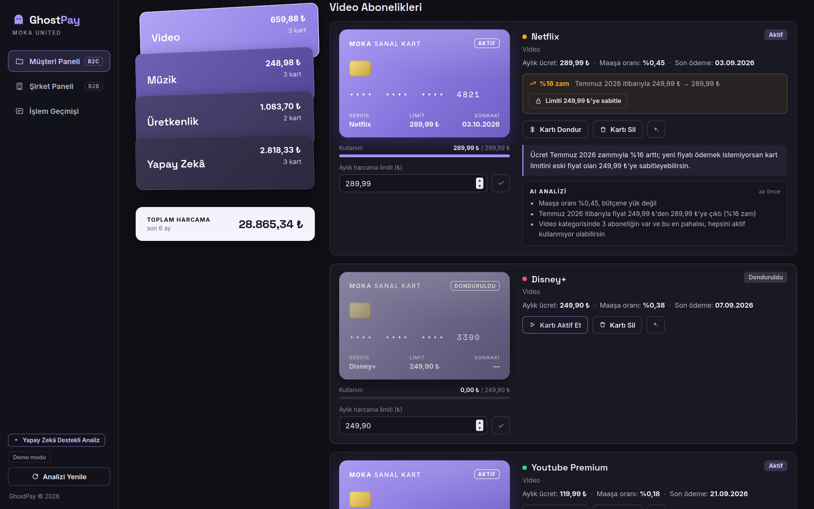
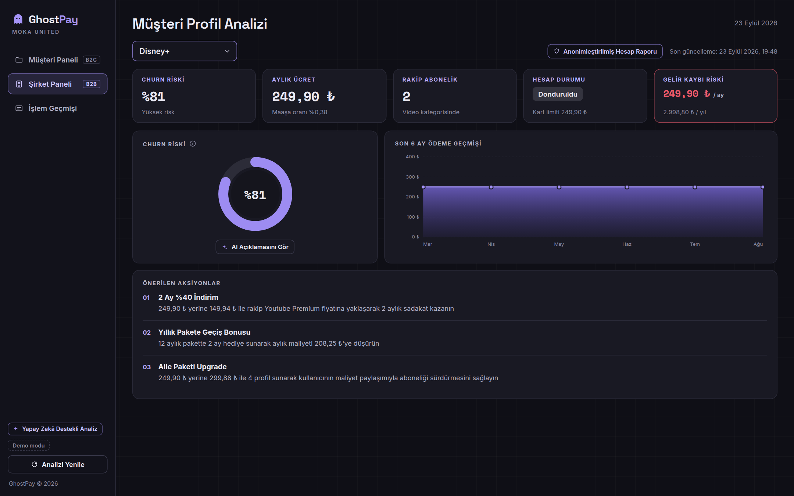
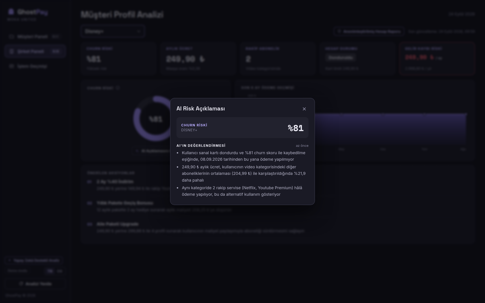
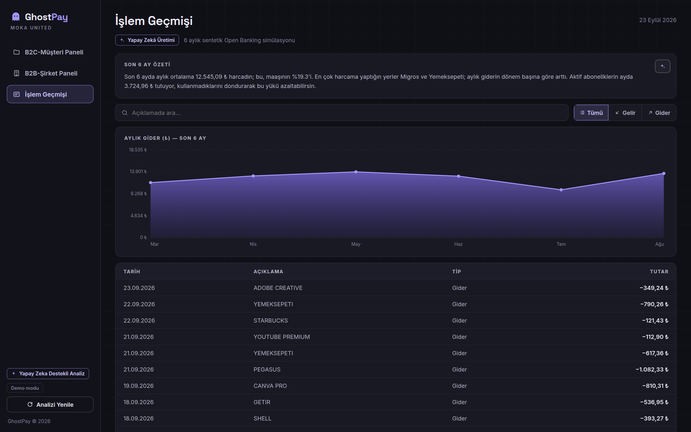
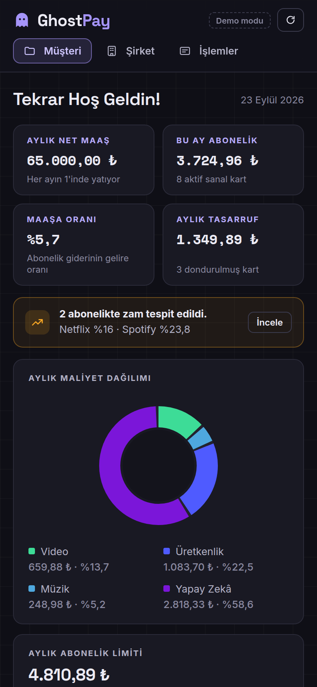
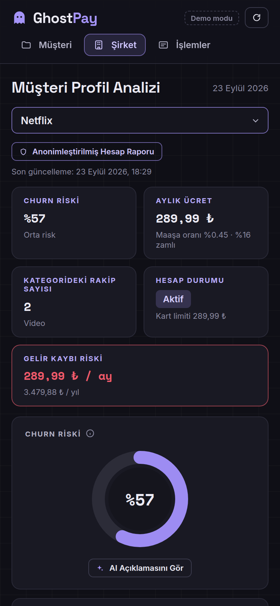
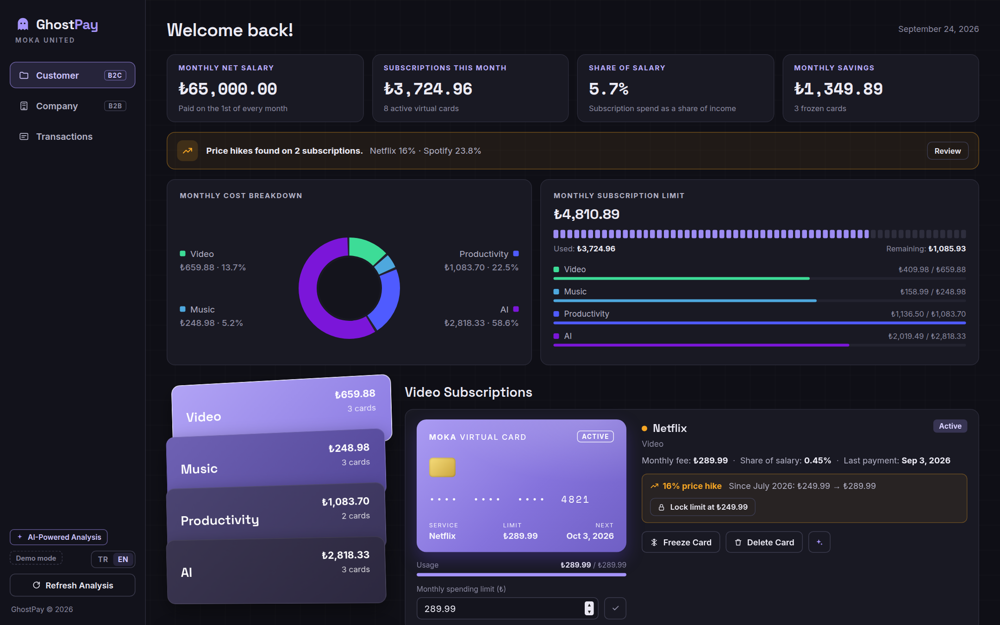
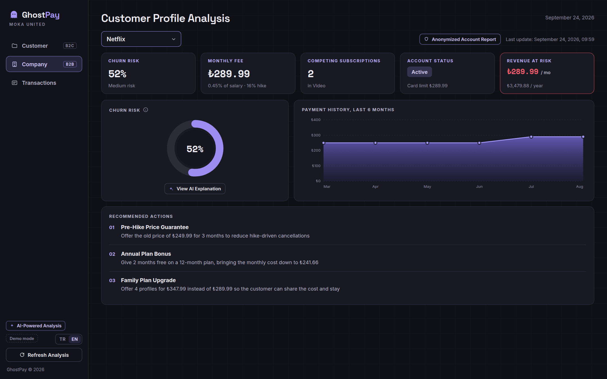

<div align="center">

# GhostPay

**Her aboneliğe ayrı sanal kart, zam tespiti ve churn analizi**
<br>
*Per-subscription virtual cards, price hike detection and churn analytics*

[](https://github.com/busebb82/Ghostpay/actions/workflows/ci.yml)


[](LICENSE)

**[Canlı demo](https://ghostpay-670i.onrender.com/?lang=tr)** · **[Live demo (English)](https://ghostpay-670i.onrender.com/?lang=en)** · [Mimari / Architecture](docs/architecture.md)



</div>

> **Moka United FinTech Hackathon: Hack the Idea** (Temmuz 2026, Coderspace iş birliğiyle) için
> geliştirildi ve 400'ü aşkın takım arasından ilk 30'a kaldı.
>
> Built for the **Moka United FinTech Hackathon: Hack the Idea** (July 2026, with Coderspace) and
> ranked in the top 30 out of 400+ teams.

[Türkçe](#türkçe) · [English](#english) · [Takım / Team](#takım--team)

---

## Türkçe

Abonelik iptali çoğu platformda bilerek zorlaştırıldığı için insanlar kullanmadıkları servislere
ödemeye devam ediyor. GhostPay bu sorunu ödeme tarafında çözüyor: her abonelik kendi Moka United
sanal kartıyla ödeniyor, kart tek dokunuşla dondurulabiliyor, silinebiliyor ya da aylık limitle
sınırlanabiliyor.

Aynı veri iki taraf için ayrı panelde yorumlanıyor. Kullanıcı nerede tasarruf edebileceğini
görüyor; abonelik şirketi ise kişisel veri almadan, anonim sinyallerle hangi müşterisini
kaybetmek üzere olduğunu ve onu nasıl tutabileceğini görüyor.

### Öne çıkanlar

- **Sanal kart kontrolü:** Dondurma, yeniden açma, geri alınabilir silme ve aylık limit. Limit ücretin altına inerse sonraki çekimin reddedileceği gösteriliyor.
- **Zam tespiti:** Ödeme geçmişindeki kalıcı fiyat artışları bulunuyor; kur oynamaları ve tek seferlik sapmalar ayıklanıyor. Limit tek tıkla eski fiyata sabitlenebiliyor.
- **Churn skoru:** Kart durumu, rakip abonelikler, fiyat, zam ve ödeme düzeninden 0-100 arası açıklanabilir bir skor; her abonelik için üç müşteriyi tutma önerisi.
- **Yapay zekâ ve yedek motor:** API anahtarı varsa analizler Claude API ile, yoksa aynı biçimde sonuç veren kural tabanlı motorla üretiliyor.
- **İki dil ve mobil:** Arayüz ve üretilen metinler Türkçe ya da İngilizce; tüm ekranlar telefonda çalışıyor.
- **Test ve yayın:** Birim testleri ve Playwright ile tarayıcı testleri her push'ta GitHub Actions'ta çalışıyor; uygulama Render'da yayında.

### Ekran görüntüleri

<table>
  <tr>
    <td width="50%"></td>
    <td width="50%"></td>
  </tr>
  <tr>
    <td align="center"><sub>Müşteri paneli ve zam uyarısı</sub></td>
    <td align="center"><sub>Sanal kart ve abonelik analizi</sub></td>
  </tr>
  <tr>
    <td></td>
    <td></td>
  </tr>
  <tr>
    <td align="center"><sub>Şirket paneli</sub></td>
    <td align="center"><sub>Churn riski açıklaması</sub></td>
  </tr>
  <tr>
    <td></td>
    <td align="center">
      
      
    </td>
  </tr>
  <tr>
    <td align="center"><sub>İşlem geçmişi</sub></td>
    <td align="center"><sub>Telefon görünümü</sub></td>
  </tr>
</table>

### Nasıl çalışıyor

1. **Tespit:** Düzenli aralıklarla ve benzer tutarla tekrarlanan ödemeler abonelik olarak ayrılıyor, kalıcı fiyat artışları zam olarak işaretleniyor.
2. **Profil:** Her abonelik için ücret, gelire oran, zam, rakip abonelikler, kart durumu ve ödeme geçmişinden anonim bir profil çıkarılıyor.
3. **Analiz:** Profil yapay zekâ motoruna gidiyor; kullanıcıya tasarruf önerisi, şirkete churn skoru ve aksiyonlar dönüyor.

Algoritmaların ve teknik kararların ayrıntısı: [docs/architecture.md](docs/architecture.md)

### Teknolojiler

Python, Flask, Gunicorn, Claude API, framework'süz JavaScript ve SVG grafikler, pytest, Playwright, Ruff, GitHub Actions, Render

### Kurulum

```bash
git clone https://github.com/busebb82/Ghostpay.git
cd Ghostpay
python3 -m pip install -r requirements.txt
python3 app.py                           # http://localhost:8501
```

Claude API ile çalıştırmak için önce `export ANTHROPIC_API_KEY="..."` komutunu çalıştırın.
Anahtar yoksa uygulama kural tabanlı motorla çalışır; canlı demo şu an bu modda.

### Testler

```bash
python3 -m pip install -r requirements-dev.txt
python3 -m playwright install chromium   # tarayıcı testleri için bir kez
pytest                                   # 31 birim + 11 tarayıcı testi
ruff check .
```

### Proje yapısı

```
app.py          Flask sunucusu ve JSON API
catalog.py      Servis listesi: ad, kategori, fiyat, çekim günü
detector.py     Abonelik ve zam tespiti, davranış profili
ai_engine.py    Claude API bağlantısı, önbellek, saatlik limit
demo_ai.py      Kural tabanlı analiz motoru (Türkçe ve İngilizce)
mock_data.py    6 aylık sentetik işlem geçmişi
static/         Arayüz: HTML, CSS, JavaScript, çeviriler, yazı tipleri
tests/          Birim testleri; tests/e2e/ altında tarayıcı testleri
docs/           Mimari belgesi, ekran görüntüleri ve demo GIF'i
```

---

## English

Many platforms make cancelling a subscription deliberately hard, so people keep paying for
services they no longer use. GhostPay solves this on the payment side: every subscription is paid
with its own Moka United virtual card that can be frozen, deleted or capped with a monthly limit in
one tap.

The same data powers two dashboards. Users see where they can save money; subscription providers
see, from anonymized signals only, which customers they are about to lose and how to keep them.

### Highlights

- **Virtual card controls:** freeze, reactivate, delete with undo and set a monthly limit, with a warning when the limit is below the price.
- **Price hike detection:** permanent price increases are found in the payment history while currency noise and one-off spikes are ignored. The limit can be locked at the old price in one click.
- **Churn score:** an explainable 0-100 score built from card status, competing subscriptions, price, hikes and payment regularity, with three retention offers per subscription.
- **AI with a fallback:** analyses come from the Claude API when a key is set, otherwise from a rule-based engine that returns the same format.
- **Bilingual and mobile:** the interface and generated texts are available in Turkish and English, and every screen works on phones.
- **Tested and deployed:** unit tests and Playwright browser tests run on every push in GitHub Actions; the app is live on Render.

<table>
  <tr>
    <td width="50%"></td>
    <td width="50%"></td>
  </tr>
  <tr>
    <td align="center"><sub>Customer dashboard</sub></td>
    <td align="center"><sub>Company dashboard</sub></td>
  </tr>
</table>

### Tech stack

Python, Flask, Gunicorn, Claude API, framework-free JavaScript with SVG charts, pytest, Playwright, Ruff, GitHub Actions, Render

### Getting started

```bash
git clone https://github.com/busebb82/Ghostpay.git
cd Ghostpay
python3 -m pip install -r requirements.txt
python3 app.py                           # http://localhost:8501
```

Set `ANTHROPIC_API_KEY` to use the Claude API; without it the rule-based engine is used, which is
how the live demo currently runs. For tests, install `requirements-dev.txt`, run
`python3 -m playwright install chromium` once and then `pytest`.

Algorithms and design decisions are described in [docs/architecture.md](docs/architecture.md#english).

---

## Takım / Team

- **Buse Bozyel** · [@busebb82](https://github.com/busebb82)
- **Ayça Bayraktar** · [@aychabayraktar](https://github.com/aychabayraktar)

---

<div align="center">
<sub>GhostPay, Moka United'ın düzenlediği hackathon için geliştirilmiş bir demo projesidir; Moka United'ın resmi bir ürünü değildir. Tüm veriler sentetiktir.</sub>
<br>
<sub>GhostPay is a hackathon demo, not an official Moka United product. All data is synthetic.</sub>
<br>
<sub><a href="LICENSE">MIT License</a> · © 2026 Buse Bozyel, Ayça Bayraktar</sub>
</div>
