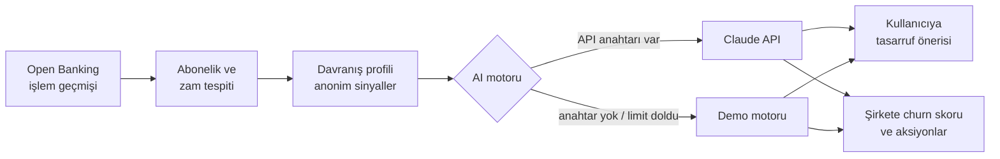

<div align="center">

# 👻 GhostPay

**Yapay zekâ destekli abonelik yönetimi · Moka United sanal kartları**
<br>
*AI-powered subscription management with per-subscription virtual cards*

[](https://github.com/busebb82/Ghostpay/actions/workflows/ci.yml)


[](LICENSE)

[Türkçe](#-türkçe) · [English](#-english)

### [▶ Canlı demo / Live demo](https://ghostpay-670i.onrender.com)
<sub>Ücretsiz sunucu uykudaysa ilk açılış ~50 sn sürebilir · First load may take ~50s while the free server wakes up</sub>


</div>

---

## 🇹🇷 Türkçe

> **Kullanıcı tasarruf eder. Şirket müşterisini kaybetmez.**

Birçok dijital platformda abonelik iptali karmaşık ve zaman alıcı olduğu için
kullanıcılar kullanmadıkları aboneliklere ödemeye devam ediyor. GhostPay bu
problemi **ödeme tarafında** çözer: her aboneliğe ayrı bir Moka United sanal kartı
bağlanır; kullanıcı kartı tek dokunuşla dondurabilir, silebilir ya da limitini
değiştirebilir. Bir platform zam yaptığında GhostPay bunu işlem geçmişinden fark
eder ve limiti eski fiyata sabitlemeyi önerir. Yapay zekâ her aboneliği çok boyutlu
değerlendirip kullanıcıya kişisel tasarruf önerileri, abonelik şirketlerine ise
anonim churn analizi ve müşteriyi tutma stratejileri sunar.

### Özellikler

| | |
|---|---|
| **Müşteri paneli** | Aylık net gelir, abonelik gideri, gelire oranı ve dondurulan kartlardan gelen tasarruf. Kategori bazında maliyet dağılımı ve tüm sanal kartların limit kullanımı. |
| **Sanal kart işlemleri** | Kartı dondur / aktif et, sil (geri alınabilir), aylık harcama limitini güncelle. Limit ücretin altına inerse *"Sonraki çekim reddedilecek"* uyarısı. |
| **Zam tespiti** | Ödemelerde kalıcı fiyat artışı yakalanır (kur oynamaları ve tek seferlik sapmalar zam sayılmaz). Kart üzerinde eski → yeni fiyat gösterilir, tek tıkla limit eski fiyata sabitlenir. |
| **AI abonelik analizi** | Harcama alışkanlıkları, ödeme geçmişi, zamlar, aynı kategorideki rakip abonelikler ve gelire oran birlikte değerlendirilerek doğal dilde kişisel öneri. |
| **Şirket paneli** | Kişisel veri paylaşılmadan, anonimleştirilmiş sinyallerle churn riski, rakip sayısı, kart durumu ve aylık/yıllık gelir kaybı riski. |
| **AI risk açıklaması ve aksiyonlar** | Churn riskinin nedenleri ve müşteriyi tutmak için kişiselleştirilmiş 3 kampanya önerisi (zam öncesi fiyat garantisi, yıllık paket, aile paketi…). |
| **İşlem geçmişi** | 6 aylık sentetik Open Banking verisi, arama, gelir/gider filtresi, aylık gider grafiği ve AI harcama özeti. |
| **Mobil** | Telefonda üst menü ve kaydırılabilir kategori kartlarıyla tam kullanım. |

<table>
  <tr>
    <td width="50%"></td>
    <td width="50%"></td>
  </tr>
  <tr>
    <td align="center"><sub>Müşteri paneli ve zam uyarısı</sub></td>
    <td align="center"><sub>Sanal kart, limiti eski fiyata sabitleme ve AI analizi</sub></td>
  </tr>
  <tr>
    <td></td>
    <td></td>
  </tr>
  <tr>
    <td align="center"><sub>Şirket paneli: churn riski ve önerilen aksiyonlar</sub></td>
    <td align="center"><sub>AI risk açıklaması</sub></td>
  </tr>
  <tr>
    <td></td>
    <td align="center">
      
      
    </td>
  </tr>
  <tr>
    <td align="center"><sub>İşlem geçmişi ve AI harcama özeti</sub></td>
    <td align="center"><sub>Telefon görünümü</sub></td>
  </tr>
</table>

### Nasıl çalışır?



1. **Tespit:** En az 3 kez, ~30 gün arayla ve benzer tutarla tekrarlanan ödemeler abonelik sayılır. Tutarın kalıcı olarak %6'dan fazla yükseldiği nokta zam olarak işaretlenir.
2. **Profil:** Her abonelik için ücret, gelire oran, zam, rakip abonelikler, kart durumu, limit ve ödeme geçmişinden bir profil çıkarılır. Şirketlere yalnızca bu anonim sinyaller iletilir.
3. **Analiz:** Profil yapay zekâ motoruna gönderilir; aynı girdiye verilen cevap önbellekten gelir.

### Yapay zekâ modları

| Mod | Ne zaman | Açıklama |
|---|---|---|
| **Claude** | `ANTHROPIC_API_KEY` tanımlıysa | Analizler Claude ile üretilir. Saatlik çağrı limiti (`AI_HOURLY_LIMIT`, varsayılan 200) herkese açık demoda maliyeti korur. |
| **Demo** | Anahtar yoksa ya da limit dolduysa | Aynı biçimdeki cevaplar davranış verisinden kural tabanlı üretilir; uygulama her zaman çalışır ve maliyeti sıfırdır. Arayüzde *Demo modu* etiketi görünür. |

### Yerelde çalıştırma

```bash
git clone https://github.com/busebb82/Ghostpay.git
cd Ghostpay
python3 -m pip install -r requirements.txt
python3 app.py            # http://localhost:8501
```

Claude ile çalıştırmak için: `export ANTHROPIC_API_KEY="sk-ant-..."` sonra `python3 app.py`.

Canlı sürüm Render'da `render.yaml` ile çalışır; `main` dalına her birleştirmede otomatik güncellenir.

### Proje yapısı

```
app.py          Flask sunucusu: sayfa, sanal kart işlemleri ve AI için JSON API
catalog.py      Bilinen servisler: ad, kategori, liste fiyatı, çekim günü
detector.py     Abonelik ve zam tespiti, AI'a giden davranış profili
ai_engine.py    Claude entegrasyonu, önbellek, saatlik limit
demo_ai.py      API anahtarı olmadan çalışan kural tabanlı analiz motoru
mock_data.py    6 aylık sentetik Open Banking işlem geçmişi
static/         Arayüz (HTML, CSS, JavaScript, yerel yazı tipleri)
tests/          pytest testleri
```

### Geliştirme

```bash
python3 -m pip install -r requirements-dev.txt
pytest          # testler
ruff check .    # lint
```

Her ziyaretçi kendi demo verisini alır; birinin kartlarda yaptığı değişiklik
diğerlerini etkilemez. Veriler bellekte tutulur ve 2 saat işlem yapılmayan
oturumlar silinir.

---

## 🇬🇧 English

> **Users save money. Companies keep their customers.**

Cancelling a subscription is often deliberately hard, so people keep paying for
services they no longer use. GhostPay solves this **on the payment side**: every
subscription gets its own Moka United virtual card that the user can freeze,
delete or cap in one tap. When a service raises its price, GhostPay spots it in
the transaction history and offers to lock the card limit at the old price. An AI
layer evaluates each subscription and gives users personal saving advice, while
subscription providers get anonymized churn analysis and retention strategies.

### Features

- **Customer dashboard:** net income, monthly subscription spend, share of income, savings from frozen cards, cost breakdown by category and limit usage of every virtual card.
- **Virtual card controls:** freeze / reactivate, delete (with undo) and update the monthly limit, with a warning when the limit drops below the price.
- **Price hike detection:** permanent price increases are detected from the charges; currency noise and one-off spikes are ignored. One click locks the limit at the old price.
- **AI subscription analysis:** spending habits, payment history, price hikes, competing subscriptions and share of income, explained in natural language.
- **Company dashboard:** churn risk, number of competitors, card status and revenue at risk, built only from anonymized signals, plus AI explanations and three retention actions.
- **Transaction history:** 6 months of synthetic Open Banking data with search, filters, a monthly spending chart and an AI summary.
- **Mobile:** full experience on phones.

### AI modes

With `ANTHROPIC_API_KEY` set, analyses are generated by **Claude**, cached per input and capped per hour (`AI_HOURLY_LIMIT`, default 200). Without a key, or once the cap is reached, a rule-based **demo engine** answers in the same format, so the public demo always works at zero cost.

### Run locally

```bash
git clone https://github.com/busebb82/Ghostpay.git
cd Ghostpay
python3 -m pip install -r requirements.txt
python3 app.py            # http://localhost:8501
```

Tests: `pip install -r requirements-dev.txt && pytest`. The live version runs on Render via `render.yaml`.

### Tech stack

Python · Flask · Gunicorn · Anthropic Claude API · vanilla JavaScript with hand-drawn SVG charts · pytest · Ruff · GitHub Actions · Render

---

<div align="center">
<sub>Demo verileri sentetiktir; gerçek banka veya kullanıcı verisi içermez. · All demo data is synthetic.</sub>
<br>
<sub>MIT License · GhostPay © 2026</sub>
</div>
