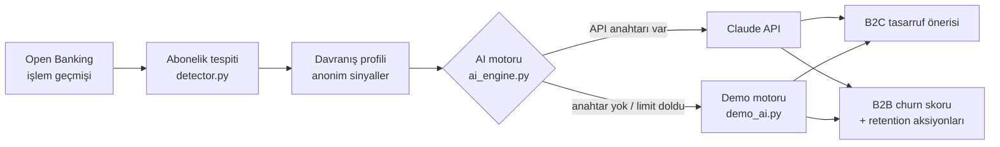

<div align="center">

# 👻 GhostPay

**Yapay zekâ destekli abonelik yönetimi · Moka United sanal kartları**
<br>
*AI-powered subscription management with per-subscription virtual cards*

[](https://github.com/busebb82/Ghostpay/actions/workflows/ci.yml)


[](LICENSE)

[Türkçe](#-türkçe) · [English](#-english)

### [▶ Canlı demo / Live demo](https://ghostpay-670i.onrender.com)
<sub>Ücretsiz sunucu uykudaysa ilk açılış ~50 sn sürebilir · First load may take ~50s while the free server wakes up</sub>


</div>

---

## 🇹🇷 Türkçe

> **Kullanıcı tasarruf eder. Şirket müşterisini kaybetmez.**

Birçok dijital platformda abonelik iptali karmaşık ve zaman alıcı olduğu için
kullanıcılar kullanmadıkları aboneliklere ödemeye devam ediyor. GhostPay bu
problemi **ödeme tarafında** çözer: her aboneliğe ayrı bir Moka United sanal kartı
bağlanır ve kullanıcı tek dokunuşla kartı dondurabilir, silebilir ya da kart
limitini güncelleyebilir. Yapay zekâ her aboneliği çok boyutlu değerlendirip
kullanıcıya kişisel tasarruf önerileri, abonelik şirketlerine ise anonim churn
analizi ve müşteriyi tutma stratejileri sunar.

### Özellikler

| | |
|---|---|
| **B2C · Müşteri Paneli** | Aylık net gelir, abonelik gideri, gelire oranı ve dondurulan kartlardan gelen tasarruf. Kategori bazında maliyet dağılımı ve tüm sanal kartların limit kullanımı. |
| **Sanal kart işlemleri** | Kartı dondur / aktif et, kartı sil, aylık harcama limitini güncelle. Limit ücretin altına inerse *"Sonraki çekim reddedilecek"* uyarısı; fiyat zammına karşı koruma. |
| **AI abonelik analizi** | Harcama alışkanlıkları, ödeme geçmişi, aynı kategorideki rakip abonelikler, fiyat seviyesi ve gelire oran birlikte değerlendirilerek doğal dilde kişisel öneri. |
| **B2B · Şirket Paneli** | Kişisel veri paylaşılmadan, anonimleştirilmiş sinyallerle churn riski, rakip sayısı, kart durumu ve aylık/yıllık gelir kaybı riski. |
| **AI risk açıklaması ve aksiyonlar** | Churn riskinin nedenleri ve müşteriyi tutmak için kişiselleştirilmiş 3 kampanya önerisi (indirim, yıllık paket, aile paketi…). |
| **İşlem Geçmişi** | 6 aylık sentetik Open Banking verisi, arama, gelir/gider filtresi, aylık gider grafiği ve AI harcama özeti. |

<table>
  <tr>
    <td></td>
    <td></td>
  </tr>
  <tr>
    <td align="center"><sub>Sanal kartlar, limit koruması ve AI analizi</sub></td>
    <td align="center"><sub>Şirket paneli: churn riski ve önerilen aksiyonlar</sub></td>
  </tr>
  <tr>
    <td></td>
    <td></td>
  </tr>
  <tr>
    <td align="center"><sub>AI risk açıklaması</sub></td>
    <td align="center"><sub>İşlem geçmişi ve AI harcama özeti</sub></td>
  </tr>
</table>

### Nasıl çalışır?



1. **Tespit:** Son 6 ayın işlemleri içinde en az 3 kez, ~30 gün arayla ve benzer tutarla tekrarlanan ödemeler abonelik olarak işaretlenir ve kategorilere ayrılır.
2. **Profil:** Her abonelik için ücret, gelire oran, rakip abonelikler, kart durumu, limit ve ödeme geçmişinden bir davranış profili çıkarılır. Şirketlere yalnızca bu anonim sinyaller iletilir.
3. **Analiz:** Profil yapay zekâ motoruna gönderilir; sonuçlar aynı girdi için önbellekte tutulur.

### Yapay zekâ modları

| Mod | Ne zaman | Açıklama |
|---|---|---|
| **Claude** | `ANTHROPIC_API_KEY` tanımlıysa | Analizler Claude ile üretilir. Saatlik çağrı limiti (`AI_HOURLY_LIMIT`, varsayılan 200) herkese açık demoda maliyeti korur. |
| **Demo** | Anahtar yoksa ya da limit dolduysa | Aynı biçimde cevaplar, davranış verisinden kural tabanlı olarak üretilir. Uygulama her zaman çalışır, maliyet sıfırdır. Arayüzde *Demo modu* etiketi görünür. |

### Yerelde çalıştırma

```bash
git clone https://github.com/busebb82/Ghostpay.git
cd Ghostpay
python3 -m pip install -r requirements.txt
python3 app.py            # http://localhost:8501
```

Claude ile çalıştırmak için (isteğe bağlı):

```bash
export ANTHROPIC_API_KEY="sk-ant-..."
python3 app.py
```

### Canlıya alma (Render)

Proje şu an **https://ghostpay-670i.onrender.com** adresinde yayında. Kendi kopyanı yayına almak için:

[](https://render.com/deploy?repo=https://github.com/busebb82/Ghostpay)

1. Render hesabınla butona tıkla (ya da **New → Blueprint** ile bu repoyu seç). `render.yaml` gerisini ayarlar.
2. İstersen **Environment** sekmesinden `ANTHROPIC_API_KEY` ekle; eklemezsen site demo modunda çalışır.
3. Ücretsiz planda servis bir süre kullanılmazsa uyur; ilk açılış ~50 sn sürebilir.

Docker ile: `docker build -t ghostpay . && docker run -p 8501:8501 ghostpay`

### Proje yapısı

```
app.py          Flask sunucusu: sayfa, sanal kart işlemleri ve AI için JSON API
detector.py     Abonelik tespiti, kategoriler ve davranış profili
ai_engine.py    Claude entegrasyonu, önbellek, saatlik limit, demo moduna geçiş
demo_ai.py      API anahtarı olmadan çalışan kural tabanlı analiz motoru
mock_data.py    6 aylık sentetik Open Banking işlem geçmişi
static/         Arayüz (HTML, CSS, JavaScript, yerel yazı tipleri)
tests/          pytest testleri
```

### Geliştirme

```bash
python3 -m pip install -r requirements-dev.txt
pytest          # testler
ruff check .    # lint
```

Her ziyaretçi kendi demo verisini alır; bir ziyaretçinin kartlarda yaptığı
değişiklikler diğerlerini etkilemez. Veriler bellekte tutulur ve 2 saat işlem
yapılmayan oturumlar silinir.

---

## 🇬🇧 English

> **Users save money. Companies keep their customers.**

Cancelling a subscription is often deliberately hard, so people keep paying for
services they no longer use. GhostPay solves this **on the payment side**: every
subscription gets its own Moka United virtual card that the user can freeze,
delete or cap with a spending limit in one tap. An AI layer evaluates each
subscription and gives users personal saving advice, while subscription
providers get anonymized churn analysis and retention strategies.

### Features

- **B2C dashboard:** net income, monthly subscription spend, share of income, savings from frozen cards, cost breakdown by category and limit usage of every virtual card.
- **Virtual card controls:** freeze / reactivate, delete, and update the monthly limit, with a warning when the limit drops below the price (the next charge will be declined).
- **AI subscription analysis:** combines spending habits, payment history, competing subscriptions in the same category, price level and share of income into natural-language advice.
- **B2B dashboard:** churn risk, number of competitors, card status and monthly/yearly revenue-at-risk, built only from anonymized signals.
- **AI risk explanation & retention actions:** the reasons behind the churn score and three personalized campaigns to keep the customer.
- **Transaction history:** 6 months of synthetic Open Banking data with search, income/expense filters, a monthly spending chart and an AI spending summary.

### AI modes

With `ANTHROPIC_API_KEY` set, analyses are generated by **Claude**, cached per input and protected by an hourly call limit (`AI_HOURLY_LIMIT`, default 200). Without a key (or once the limit is reached) a rule-based **demo engine** returns answers in the same format from the same behavioural data, so the public demo always works at zero cost.

### Live demo

**https://ghostpay-670i.onrender.com**. The free instance sleeps when idle, so the first load can take ~50 seconds.

### Run locally

```bash
git clone https://github.com/busebb82/Ghostpay.git
cd Ghostpay
python3 -m pip install -r requirements.txt
python3 app.py            # http://localhost:8501
```

### Deploy

Click **Deploy to Render** above (or create a Blueprint from this repo); `render.yaml` configures the service. Optionally add `ANTHROPIC_API_KEY` under *Environment*. A `Dockerfile` is included for other platforms.

### Tech stack

Python · Flask · Gunicorn · Anthropic Claude API · vanilla JavaScript with hand-drawn SVG charts · pytest · GitHub Actions

---

<div align="center">
<sub>Demo verileri sentetiktir; gerçek banka veya kullanıcı verisi içermez. · All demo data is synthetic.</sub>
<br>
<sub>MIT License · GhostPay © 2026</sub>
</div>
