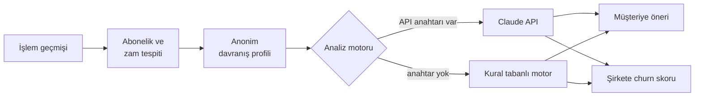

<div align="center">

# GhostPay

Abonelik yönetimi için sanal kart ve churn analizi uygulaması
<br>
*Subscription management with per-subscription virtual cards and churn analysis*

[](https://github.com/busebb82/Ghostpay/actions/workflows/ci.yml)


[](LICENSE)

[Türkçe](#türkçe) · [English](#english) · [Canlı demo / Live demo](https://ghostpay-670i.onrender.com)


</div>

---

## Türkçe

Birçok platformda abonelik iptal etmek zor olduğu için insanlar kullanmadıkları
servislere ödeme yapmaya devam ediyor. GhostPay her aboneliğe ayrı bir Moka United
sanal kartı bağlıyor. Kart dondurulabiliyor, silinebiliyor ya da limiti
değiştirilebiliyor; böylece iptal işlemi ödeme tarafında yapılmış oluyor.

Uygulamanın iki paneli var:

- **Müşteri paneli:** Abonelik giderleri, kategori dağılımı ve her aboneliğin sanal kartı. Bir servis zam yaptığında uyarı çıkıyor ve kart limiti tek tıkla eski fiyata sabitlenebiliyor.
- **Şirket paneli:** Abonelik şirketinin göreceği ekran. Kişisel veri olmadan, anonim sinyallerle churn riski, gelir kaybı riski ve müşteriyi tutmak için önerilen kampanyalar.

GhostPay bir demo projesidir ve Moka United'ın resmi bir ürünü değildir; şirket adı senaryoyu
anlatmak için kullanılmıştır. Tüm veriler sentetiktir.

### Özellikler

| | |
|---|---|
| **Müşteri paneli** | Aylık gelir, abonelik gideri, gelire oranı ve dondurulan kartlardan gelen tasarruf. Kategori bazında maliyet dağılımı ve kart limitlerinin kullanımı. |
| **Sanal kart işlemleri** | Kartı dondurma, tekrar açma, silme (geri alınabilir) ve aylık limit değiştirme. Limit ücretin altına inerse sonraki çekimin reddedileceği gösteriliyor. |
| **Zam tespiti** | Ödemelerdeki kalıcı fiyat artışları bulunuyor. Kur farkından kaynaklanan küçük oynamalar ve tek seferlik sapmalar zam sayılmıyor. |
| **Abonelik analizi** | Ödeme geçmişi, zamlar, aynı kategorideki diğer abonelikler ve gelire oran üzerinden kişisel öneri. |
| **Churn riski** | Her abonelik için 0-100 arası skor. Kartın dondurulması riski en çok artıran sinyal; düzenli ödeme geçmişi riski düşürüyor. |
| **Retention önerileri** | Her abonelik için 3 kampanya önerisi: zam öncesi fiyat garantisi, yıllık paket, aile paketi gibi. |
| **İşlem geçmişi** | 6 aylık sentetik Open Banking verisi, arama, gelir/gider filtresi, aylık gider grafiği ve harcama özeti. |
| **Mobil** | Telefonda da tüm ekranlar kullanılabiliyor. |

<table>
  <tr>
    <td width="50%"></td>
    <td width="50%"></td>
  </tr>
  <tr>
    <td align="center"><sub>Müşteri paneli ve zam uyarısı</sub></td>
    <td align="center"><sub>Sanal kart ve abonelik analizi</sub></td>
  </tr>
  <tr>
    <td></td>
    <td></td>
  </tr>
  <tr>
    <td align="center"><sub>Şirket paneli</sub></td>
    <td align="center"><sub>Churn riski açıklaması</sub></td>
  </tr>
  <tr>
    <td></td>
    <td align="center">
      
      
    </td>
  </tr>
  <tr>
    <td align="center"><sub>İşlem geçmişi</sub></td>
    <td align="center"><sub>Telefon görünümü</sub></td>
  </tr>
</table>

### Nasıl çalışıyor



1. En az 3 kez, yaklaşık 30 gün arayla ve benzer tutarla tekrarlanan ödemeler abonelik sayılıyor. Tutar kalıcı olarak %6'dan fazla arttıysa zam olarak işaretleniyor.
2. Her abonelik için ücret, gelire oran, zam, aynı kategorideki abonelikler, kart durumu, limit ve ödeme geçmişinden bir profil çıkarılıyor. Şirket paneline yalnızca bu anonim bilgiler gidiyor.
3. Profil analiz motoruna gönderiliyor. Aynı profil için daha önce üretilmiş sonuç varsa tekrar hesaplanmıyor.

### Teknik kararlar

**Abonelik tespiti.** Aynı açıklamayla en az 3 kez, 25-35 gün arayla gelen ve tutarları birbirine
yakın olan (standart sapma ortalamanın %15'inden az) giderler abonelik sayılıyor. Sonraki ödeme
tarihi son ödemenin gününe göre hesaplanıyor, kısa aylarda ayın son gününe yuvarlanıyor.

**Zam tespiti.** Ödeme geçmişi her noktadan ikiye bölünüp sondan başa doğru deneniyor. Sonraki
ödemelerin en düşüğü önceki ödemelerin en yükseğinden en az %2 fazlaysa ve ortanca tutar en az %6
arttıysa o nokta zam kabul ediliyor. Böylece dövizli servislerdeki %3'lük kur oynamaları ve tek
seferlik yüksek bir çekim zam sayılmıyor.

**Churn skoru.** 20 puandan başlıyor, sinyallere göre artıp azalıyor:

| Sinyal | Etki |
|---|---|
| Sanal kart dondurulmuş | +50 |
| Aynı kategoride aktif rakip abonelik | her biri +7, en fazla +14 |
| Aktif rakiplerin ortalamasından pahalı | en fazla +10 |
| Kategorideki en ucuz aktif seçenek | -4 |
| Ücretin maaşa oranı | en fazla +6 |
| Kart limiti ücretin altında | +18 |
| Son zam | zam oranının 1,25 katı, en fazla +20 |
| Kesintisiz ödenen her ay | -1, en fazla -8 |

Sonuç 0-39 ise düşük, 40-64 orta, 65 ve üzeri yüksek risk. Dondurulmuş bir rakip abonelik rekabet
sayılmıyor, çünkü kullanıcının o servisi bıraktığını gösteriyor. Claude API'ye de aynı ölçek
veriliyor.

**Tek worker.** Demo oturumları bellekte tutulduğu için gunicorn tek süreç ve 8 thread ile
çalışıyor. Birden fazla süreç olsaydı aynı ziyaretçinin istekleri farklı süreçlere düşüp farklı
veri görebilirdi. Oturumlar ziyaretçi başına bir çerezle ayrılıyor, 2 saat işlem yapılmazsa
siliniyor ve en fazla 300 oturum tutuluyor.

**Veritabanı yok.** Render'ın ücretsiz planında disk kalıcı değil, her yeniden başlatmada
siliniyor. Bu yüzden veriler bellekte tutuluyor. Kalıcı veri gerekirse oturumlar Redis'e ya da
yönetilen bir veritabanına taşınabilir.

**Arayüz.** Framework kullanılmadı; düz JavaScript ile yazıldı, grafikler SVG ile çiziliyor ve
yazı tipleri sunucudan geliyor. Content Security Policy satır içi script'e izin vermediği için
tüm tıklamalar `data-action` öznitelikleriyle tek bir yerden yönetiliyor.

**Uyanık tutma.** Ücretsiz sunucu 15 dakika istek gelmezse uyuyor. `keepalive.yml` iş akışı
siteye 10 dakikada bir istek atıyor, böylece linke tıklayan kişi beklemiyor.

### Analiz motoru

`ANTHROPIC_API_KEY` ortam değişkeni tanımlıysa analizler Claude API ile yapılıyor. Herkese açık
demoda maliyeti sınırlamak için saatlik çağrı limiti var (`AI_HOURLY_LIMIT`, varsayılan 200).

Claude API'ye profil JSON olarak gönderiliyor ve cevabın biçimi JSON şemasıyla sabitleniyor.
Aynı profil için daha önce alınmış cevap varsa tekrar istek atılmıyor.

Anahtar yoksa, limit dolduysa ya da API hata verirse aynı biçimdeki sonuçlar kural tabanlı bir
motorla üretiliyor ve arayüzde "Demo modu" etiketi görünüyor. Canlı demo şu an bu modda çalışıyor.

### Yerelde çalıştırma

```bash
git clone https://github.com/busebb82/Ghostpay.git
cd Ghostpay
python3 -m pip install -r requirements.txt
python3 app.py            # http://localhost:8501
```

Claude API ile çalıştırmak için önce `export ANTHROPIC_API_KEY="..."` komutunu çalıştırın.

Canlı sürüm Render'da `render.yaml` ile çalışıyor ve `main` dalına yapılan her birleştirmede güncelleniyor.

### Proje yapısı

```
app.py          Flask sunucusu ve JSON API
catalog.py      Servis listesi: ad, kategori, fiyat, çekim günü
detector.py     Abonelik ve zam tespiti, davranış profili
ai_engine.py    Claude API bağlantısı, önbellek, saatlik limit
demo_ai.py      Kural tabanlı analiz motoru
mock_data.py    6 aylık sentetik işlem geçmişi
static/         Arayüz (HTML, CSS, JavaScript, yazı tipleri)
tests/          pytest testleri
```

### Geliştirme

```bash
python3 -m pip install -r requirements-dev.txt
pytest
ruff check .
```

Her ziyaretçinin demo verisi ayrı tutuluyor, yapılan değişiklikler diğer ziyaretçileri
etkilemiyor. Veriler bellekte duruyor; 2 saat işlem yapılmayan oturumlar siliniyor.

---

## English

People often keep paying for subscriptions they no longer use because cancelling is
hard. GhostPay gives every subscription its own Moka United virtual card that can be
frozen, deleted or given a monthly limit, so the subscription can be stopped from the
payment side.

The app has two dashboards:

- **Customer dashboard:** subscription spending, category breakdown and a virtual card for each subscription. When a service raises its price, a warning appears and the card limit can be locked at the old price.
- **Company dashboard:** what the subscription provider sees. Churn risk, revenue at risk and suggested retention offers, based only on anonymized signals.

GhostPay is a demo project and not an official Moka United product; the company name is used
for the scenario. All data is synthetic.

### Features

- Freeze, reactivate, delete (with undo) and set a monthly limit on each virtual card
- Price hike detection that ignores currency noise and one-off spikes
- Personal advice per subscription based on payment history, price hikes and similar subscriptions
- Churn score from 0 to 100 with an explanation and three retention offers
- Six months of synthetic Open Banking transactions with search, filters and a monthly chart
- Works on phones

### Analysis engine

With `ANTHROPIC_API_KEY` set, analyses come from the Claude API. Results are cached per input and
calls are capped per hour (`AI_HOURLY_LIMIT`, default 200). Without a key, or once the cap is
reached, a rule-based engine returns results in the same format.

### Design notes

- **Price hikes:** the payment history is split at each point, newest first. A point counts as a hike when every later charge is at least 2% above every earlier one and the median rises by at least 6%, so currency noise and one-off spikes are ignored.
- **Churn score:** starts at 20 and moves with the signals in the table in the Turkish section: +50 for a frozen card, +18 for a limit below the price, up to +20 for a price hike, minus one point per paid month (at most 8). 0-39 is low, 40-64 medium, 65+ high.
- **Single worker:** demo sessions live in memory, so gunicorn runs one process with 8 threads. Render's free plan has no persistent disk, which is why there is no database.
- **Keep alive:** a scheduled workflow pings the site every 10 minutes so the free server does not sleep.

The live demo currently runs the rule-based engine.

### Run locally

```bash
git clone https://github.com/busebb82/Ghostpay.git
cd Ghostpay
python3 -m pip install -r requirements.txt
python3 app.py            # http://localhost:8501
```

Tests: `pip install -r requirements-dev.txt && pytest`

### Tech stack

Python, Flask, Gunicorn, Claude API, vanilla JavaScript with SVG charts, pytest, Ruff, GitHub Actions, Render

---

<div align="center">
<sub>Demo verileri sentetiktir. All demo data is synthetic.</sub>
<br>
<sub>MIT License · GhostPay 2026</sub>
</div>
