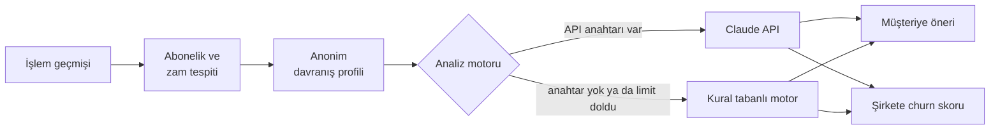

# Mimari / Architecture

[Türkçe](#türkçe) · [English](#english)

## Türkçe

### Veri akışı

### Abonelik tespiti

Aynı açıklamayla en az 3 kez, 25-35 gün arayla gelen ve tutarları birbirine yakın olan
(standart sapma ortalamanın %15'inden az) giderler abonelik sayılır. Sonraki ödeme tarihi son
ödemenin gününe göre hesaplanır, kısa aylarda ayın son gününe yuvarlanır.

### Zam tespiti

Ödeme geçmişi her noktadan ikiye bölünür ve sondan başa doğru denenir. Sonraki ödemelerin en
düşüğü önceki ödemelerin en yükseğinden en az %2 fazlaysa ve ortanca tutar en az %6 arttıysa o
nokta zam kabul edilir. Böylece dövizli servislerdeki %3'lük kur oynamaları ve tek seferlik
yüksek bir çekim zam sayılmaz.

### Churn skoru

Skor 20 puandan başlar ve sinyallere göre değişir:

| Sinyal | Etki |
|---|---|
| Sanal kart dondurulmuş | +50 |
| Aynı kategoride aktif rakip abonelik | her biri +7, en fazla +14 |
| Aktif rakiplerin ortalamasından pahalı | en fazla +10 |
| Kategorideki en ucuz aktif seçenek | -4 |
| Ücretin maaşa oranı | en fazla +6 |
| Kart limiti ücretin altında | +18 |
| Son zam | zam oranının 1,25 katı, en fazla +20 |
| Kesintisiz ödenen her ay | -1, en fazla -8 |

0-39 düşük, 40-64 orta, 65 ve üzeri yüksek risktir. Dondurulmuş bir rakip abonelik rekabet
sayılmaz, çünkü kullanıcının o servisi bıraktığını gösterir. Claude API'ye de aynı ölçek verilir,
böylece iki motorun sonuçları tutarlı kalır.

### Analiz motoru

`ANTHROPIC_API_KEY` tanımlıysa analizler Claude API ile yapılır. İstekte profil JSON olarak
gönderilir, cevabın biçimi JSON şemasıyla sabitlenir. Sonuçlar girdinin özetine göre önbelleğe
alınır ve saatlik çağrı limiti (`AI_HOURLY_LIMIT`, varsayılan 200) maliyeti sınırlar. Anahtar
yoksa, limit dolduysa ya da API hata verirse aynı biçimde sonuç üreten kural tabanlı motor devreye
girer ve arayüzde "Demo modu" etiketi görünür.

### Oturumlar

Her ziyaretçi bir çerezle kendi demo verisini alır; birinin kartlarda yaptığı değişiklik
diğerlerini etkilemez. Oturumlar bellekte tutulduğu için gunicorn tek süreç ve 8 thread ile
çalışır. Birden fazla süreç olsaydı aynı ziyaretçinin istekleri farklı süreçlere düşüp farklı veri
görebilirdi. 2 saat işlem yapılmayan oturumlar silinir, en fazla 300 oturum tutulur.

Render'ın ücretsiz planında disk kalıcı olmadığı için veritabanı kullanılmadı. Kalıcı veri
gerekirse oturumlar Redis'e ya da yönetilen bir veritabanına taşınabilir.

### İki dil

Veri anahtarları (kategori, kart durumu, işlem tipi) Türkçe kalır; arayüz bunları yalnızca
gösterirken çevirir. Tarayıcı her istekte `X-Lang` başlığını gönderir. Dil değişince sunucu o
ziyaretçinin analizlerini yeni dilde baştan üretir. Önbellek anahtarı dili de içerdiği için iki
dilin sonuçları karışmaz.

### Arayüz

Framework kullanılmadı: düz JavaScript, SVG ile çizilen grafikler ve sunucudan gelen yazı tipleri.
Content Security Policy satır içi script'e izin vermediği için tüm tıklamalar `data-action`
öznitelikleriyle tek bir yerden yönetilir.

### Testler ve yayın

- `tests/`: abonelik ve zam tespiti, churn skoru, API ve iki dildeki metinler için birim testleri.
- `tests/e2e/`: Playwright ile gerçek Chromium'da kart dondurma, limit değiştirme, silip geri alma,
  şirket paneli, dil değiştirme ve telefon görünümü testleri.
- GitHub Actions her push'ta lint'i, birim testlerini (Python 3.11-3.13) ve tarayıcı testlerini
  çalıştırır.
- Uygulama Render'da `render.yaml` ile yayınlanır; `main` dalına her birleştirmede güncellenir.
  Ücretsiz sunucunun uyumaması için UptimeRobot `/healthz` adresini 5 dakikada bir kontrol eder.

---

## English

### Data flow

Transactions go through subscription and price hike detection, then become an anonymous behaviour
profile. The profile is analysed by the Claude API when a key is set, otherwise by the rule-based
engine. The customer gets personal advice and the company gets a churn score with retention offers.

### Subscription detection

An expense counts as a subscription when the same description appears at least 3 times, 25-35
days apart, with similar amounts (standard deviation under 15% of the mean). The next due date keeps
the day of the last payment and falls back to the last day of shorter months.

### Price hike detection

The payment history is split at each point, newest first. A point counts as a hike when every later
charge is at least 2% above every earlier one and the median rises by at least 6%, so ±3% currency
noise and one-off spikes are ignored.

### Churn score

The score starts at 20. A frozen card adds 50, each active competing subscription adds 7 (up to 14),
being more expensive than active competitors adds up to 10, the salary share adds up to 6, a limit
below the price adds 18 and a price hike adds 1.25 times the increase (up to 20). The cheapest active
option loses 4 points and every paid month removes 1 (up to 8). 0-39 is low, 40-64 medium and 65+
high risk. Frozen competitors do not count as competition. Claude gets the same scale.

### Analysis engine

With `ANTHROPIC_API_KEY` set, the profile is sent to the Claude API as JSON and the answer is
constrained by a JSON schema. Results are cached per input and calls are capped per hour
(`AI_HOURLY_LIMIT`, default 200). Without a key, after the cap or on an API error, a rule-based
engine returns results in the same format.

### Sessions

Each visitor gets their own demo data through a cookie. Sessions live in memory, so gunicorn runs
one process with 8 threads; idle sessions expire after 2 hours and at most 300 are kept. Render's
free plan has no persistent disk, so there is no database.

### Two languages

Data keys stay Turkish and the interface translates them for display. The browser sends an
`X-Lang` header; when it changes, the server regenerates that visitor's analyses, and the cache key
includes the language.

### Tests and deployment

Unit tests cover detection, the churn score, the API and both languages. Browser tests in
`tests/e2e/` drive the app in Chromium with Playwright. GitHub Actions runs lint, unit tests on
Python 3.11-3.13 and the browser tests on every push. The app is deployed on Render from
`render.yaml` on every merge to `main`; UptimeRobot checks `/healthz` every 5 minutes to keep the free instance
awake.
